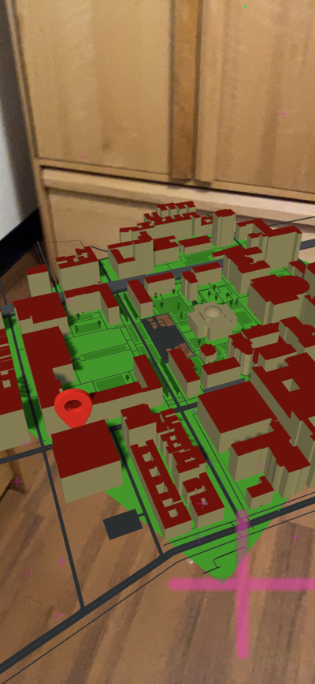

# Unity-ARFoundation-echoAR-demo-Location-Visualizer

Map location visualizer demo with Unity, ARFoundation, and echoAR.

## Setup
### Basics
* Clone [Unity-ARFoundation-echoAR-example](https://github.com/echoARxyz/Unity-ARFoundation-echoAR-example) repo and follow the instructions on [documentation page](https://docs.echoar.xyz/unity/adding-ar-capabilities) to get your project up and running
* Ensure that you have set your API key as described in the documentation

### LocationVisualizer
* Clone this repo
* Overwrite ```Assets > echoAR > echoAR.cs``` with the corresponding file in this repo

## echoAR Console
* In the ```Content``` page under Manage, select the option to upload new files
* Upload **both** files in the directory ```MapPinConsoleObject``` located in this repo
* Ensure that you selected **both** ```Map_Pin.bin``` and ```Map_Pin.gltf``` for a single object upload
* Update your ```<API_KEY>``` and ```<PIN_ENTRY_ID``` in ```echoAR.cs```
* Upload **both** files in the directory ```ColumbiaMapConsoleObject``` located in this repo
* Ensure that you selected **both** ```Columbia_Map.obj``` and ```Columbia_Map.mtl``` for a single object upload
* Add key-value pairs of ```name: PIN, scale: 0.15, direction: right``` to the ```Map_Pin.gltf``` model
* Add key-value pairs of ```name: MAP, scale: 0.001``` to the ```Columbia_Map.obj``` model

## Run
* Save, build and run the project just as you would for [Unity-ARFoundation-echoAR](https://docs.echoar.xyz/unity/adding-ar-capabilities)

Note: These instructions assume that you are familiar with building and running the project for your desired platform (iOS, Android...) Please consult external resources if you are having difficulties in this process.

## Usage
* In the [echoAR console](https://console.echoar.xyz/#/pages/data), go to ```Data``` tab under Manage
* In the ```Global database``` table, set ```latitude``` and ```longitude``` keys for the desired GPS coordinates
* Location is retrieved with an HTTP GET request to echoAR's API from the ```Global database```

## Screenshots
### Columbia University Map Pinned


## Attributions
* "Map Pin" (https://skfb.ly/6SVFx) by Ilyas.King is licensed under Creative Commons Attribution (http://creativecommons.org/licenses/by/4.0/).

## Support
Feel free to reach out at [support@echoAR.xyz](mailto:support@echoAR.xyz) or join our [support channel on Slack](https://join.slack.com/t/echoar/shared_invite/enQtNTg4NjI5NjM3OTc1LWU1M2M2MTNlNTM3NGY1YTUxYmY3ZDNjNTc3YjA5M2QyNGZiOTgzMjVmZWZmZmFjNGJjYTcxZjhhNzk3YjNhNjE)
